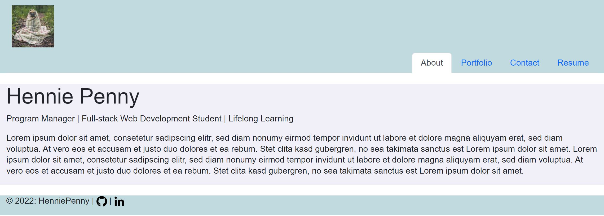

# 20-React-Portfolio

The challenge is to build a portfolio page using React.

# User Story

AS AN employer looking for candidates with experience building single-page applications  
I WANT to view a potential employee's deployed React portfolio of work samples  
SO THAT I can assess whether they're a good candidate for an open position

# Screenshot

# Challenges

- understanding the logic of components and props
- using Bootstrap for styling, which was new to me

# Links

- [Deployment Link](https://henniepenny.github.io/20-react-portfolio/)
- [Repository Link](https://github.com/HenniePenny/20-react-portfolio)
